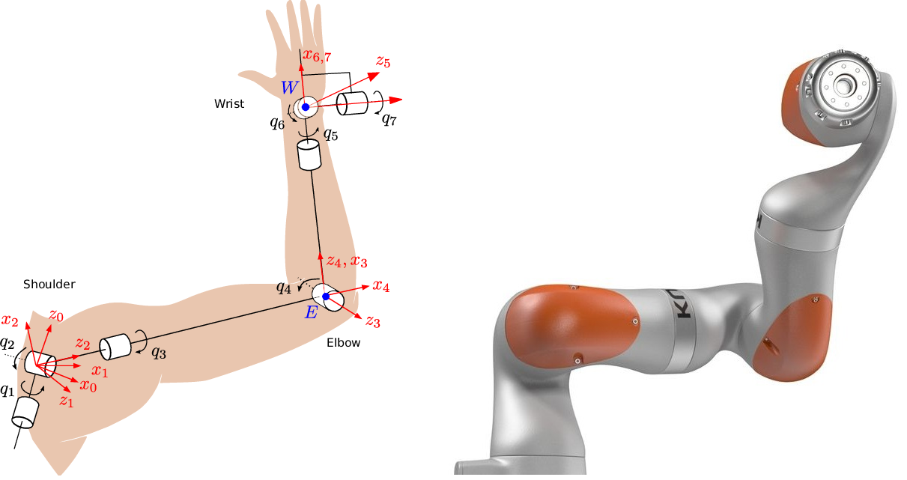
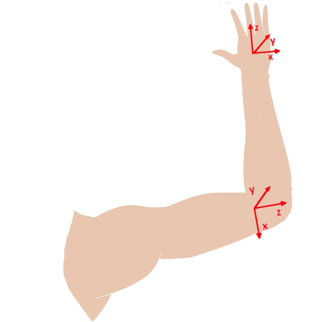
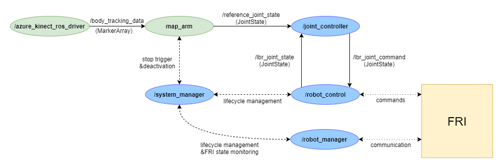

# kinect_ros (Arm tracking with Azure Kinect and LBR iiwa)
## The Azure Kinect driver node

Travis CI | SonarCloud
------------| ---------------
[](https://app.travis-ci.com/github/kroshu/kinect_ros) | [](https://sonarcloud.io/dashboard?id=kroshu_kinect_ros)

### Prerequsites:
- Windows computer with strong graphics card, Linux computer for the other nodes
- Visual Studio (for colcon build)
- OpenCV (I downloaded the exe for version 3.4.4 from https://github.com/opencv/opencv/releases/tag/3.4.4)
- ros2 galactic for Windows (foxy didn't work for me, probably because of image_tansport package, which is included in galactic) -> download latest release version from official ros website

- cv_bridge package (in vision_opencv repo)
- python 3.8 **with debug binaries** (can be ticked in installation UI in advanced options)
- Boost installation (only prebuilt windows binaries worked for me: https://sourceforge.net/projects/boost/files/boost-binaries/1.74.0/boost_1_74_0-msvc-14.1-64.exe/download)
- Azure Kinect SDK
- Azure Kinect Body Tracking SDK

- Required packages:
    - Azure_Kinect_Ros_Driver (foxy-devel branch)
        - dnn_model.onnx file name might have to be changed in Findk4abt.cmake because of different versions
        - angles.h header file is needed (can be found on GitHub)
    - ros2_kuka_sunrise (kroshu)
    - kinect_ros (kroshu)
    - urdflbriiwa14
    - robot_control

### Running the node
After building (colcon build in VS terminal) the node can be run with the 'ros2 run azure_kinect_ros_driver node --ros-args -p body_tracking_enabled:=true' command in a sourced terminal. (Or as a small cheat the default value of the parameter "body_tracking_enabled" can be changed to true in the k4a_ros_device_params.h header, so that the 'ros2 run azure_kinect_ros_driver node' command starts the bodytracking too.)

### Connecting the Windows and Linux machines
Since ROS2 no bridge is needed between multiple machines, but the communication method must be set up, which I achieved with the following environment variables:
- RMW_IMPLEMENTATION := rmw_fastrtps_cpp
- ROS_DOMAIN_ID := 0 #this ID is also set on the linux machine in bashrc, by another ID, both that, and the enable firewall ports must be changed (see later)
- FASTRTPS_DEFAULT_PROFILES_FILE := <*location_to_xml*>\com_interface.xml

where com_interface xml is:
```xml
<?xml version="1.0" encoding="UTF-8" ?>
<profiles xmlns="http://www.eprosima.com/XMLSchemas/fastRTPS_Profiles">
    <transport_descriptors>
        <transport_descriptor>
            <transport_id>CustomUDPTransport</transport_id>
            <type>UDPv4</type>
            <interfaceWhiteList>
                <address><insert-your-ip1-here></address>
				<address><insert-your-ip2-here></address>

            </interfaceWhiteList>
        </transport_descriptor>
    </transport_descriptors>
    <participant profile_name="CustomUDPTransportParticipant">
        <rtps>
            <userTransports>
                <transport_id>CustomUDPTransport</transport_id>
            </userTransports>
        </rtps>
    </participant>
</profiles>
```

A few ports must also be enabled in firewall settings to let the messages through. By the domain ID of 0, I enabled ports 7410-7425 in both directions. (According to the documentation the exact port number is 7400 + 250 * domainID + 10 + 2 * participantID)
To try out the connection the demo nodes talker and listener are recommended.
The camera driver node publishes messages on the *body_tracking_data* topic, each message a MarkerArray consisting of 31 markers, one for each joint position.

The driver connects the Sunrise Fast Robot Interface with ROS. To start the simulation an Office PC is needed, while the ROS nodes should be run on a Linux machine. The Sunrise Workbench application is needed to configure the simulation (install, synchronize and set T1 in OfficeMode), but is only for visualisation purposes during the simulation. To be able to execute faster movements, the T2 mode must be set in the WorkBench.

### The structure of the driver nodes
The system_manager node connects the robot_manager and robot_contol nodes and stops them if necessary (more on that later). The robot_manager node handles and configures the connection to the Sunrise FRI, while the robot_control sends the necessary commands to the robot. The joint_controller is necessary to enforce the joint, velocity and effort limits of the robot, otherwise a requested joint state too far away from the actual state would result in the stopping of the FRI session. The FRI has 4 states, commands are only executed, if the state is 4.

<p align="center">

</p>
The joint_controller receives the required joint positions, interpolates them if the distance is above the limits, then the robot_control sends the calculated command to FRI. It also monitors the actual state of the robot with a frequency of 100Hz, and publishes it (*/lbr_joint_state*). The robot_control node and the FRI controls the robot, so a ros_control implementation is not necessary, so it is only necessary to calculate the reference joint positions from the required cartesian positions. 


### Stopping the robot motion
The FRI session stops immediately, if the current position of the robot is not received, or if an invalid command is given (invalid meaning, that one of the limits is exceeded). In that case the system_manager, which constantly monitors the FRI state, deactivates the robot_control and robot_manager node. The deactivation of these nodes would also stop the robot motion if the FRI state was 4. Therefore deactivating these nodes is a suitable way to stop the robot externally, for this goal the system_manager node has a service (system_manager/trigger_change), which deactivates the two other nodes if it receives a trigger message. 


### Processing the camera image
The azure_kinect_ros_driver node publishes 31 markers on the body_tracking_data topic, from which the relevant ones can be processed. For full arm tracking, shoulder, elbow, wrist and 3 other joints of the hand are needed. The required joint angles are calculated by implementing the inverse kinematics calculations.
The node sends a trigger request to stop the robot, if the left hand is raised, if more bodies are in view, or if it doesn't receive a marker for one of the necessary body parts.
The coordinate system of the camera is different from that of the robot, so before the calculations, a transformation is needed. To rotate the coordinate system of the camera into that of the robot, the system is rotated with +90° around the x axis, then with -90° around the new z axis.

<p align="center">

</p>

## Project roadmap

### 1. Moveit with planning and trajectory execution (endpont_tracing branch)

At first the full potential of moveit was used with planning and trajectory execution with a fake controller. Moveit received the required relative position, computed the inverse kinematics, planned the motion according to the robot modell, then executed it with the fake controller manager (which basically echos its input as the real joint states).

The first experiments showed, that the execution cannot be stopped, a new reference got into the queue but the previous one had to be reached to start the new execution, so the latency of the motion was very big. This could be solved by setting the execution to non-blocking, this way when a new reference was received, the previous motion was stopped immediately. But this resulted in a very jerky movement, as the stopping of the execution means a velocity and acceleration of 0, so the robot had to stop completely by every new command (5 times every second).

### 2. Moveit servo body tracking

According to the moveit documentation, such problems could be solved with moveit servo, which has a body tracking functionality and can achieve a smooth motion by calculating the reference joint positions from the required velocity to reach the designated point. The implementation however had a big drawback, as the twist messages (the required velocity) were calculated without taking the robot model and the joint states into account calculated with the help of the Jacobian matrix. This means that in a lot of cases there are no valid joint positions for the required velocity and the robot also got stuck in singularities, as the Jacobian matrix had no solution there. A conclusion for this approach is, that it is only possible to servo linearly in the cartesian space, which defines too many limits for the body tracking. This solution only works in a very small workspace, where the joint limits and singularities are further away. (This way it would be possible to configure the robot workspace, so that specific small motions could be tracked, but for bigger moition the body tracking functionality is not working.)
 
### 3. Moveit servo with jogging input

The servo node has another option, which can accept control_msgs/JointJog messages, which has displacement and velocity fields. It is not stated in the documentation, but it works only if the velocity field is not empty, it doesn't work with  position differences as input. This means, that the servo node can't solve this problem, as computing the required velocities allowed by the robot modell is a very complex inverse kinematics problem, after which the moveit servo node would not have a real purpose. So all in all the moveit servo node with jogging input works if we want to move our robot in the cartesian space linearly, but it can't calculate the required velocities for a given robot modell.

### 4. Moveit with only planning 

As the moveit servo node did not have the required functionalities, a solution must be found with the simple moveit node. The main problem was that no matter if the execution was blocking or non-blocking, the motion had to be stopped completely before a new goal state could be executed. Therefore removing the execution part (which is only a fake execution without a real controller) could solve the problem. The moveit API allows it to use the results of the planning (inverse kinematics and collision avoidance), so the endpoint for each planning session (a single joint configuration) can be sent to the joint controller for execution.

This concept successfully eliminated the complete stopping after every new reference, but the movement was still jerky, as consecutive planning sessions could result in very different joint configurations. (Because of the 7 degrees of freedom, a huge amount of joint states are possible for a given cartesian position, some of them very far from each other. Therefore it is possible that a few joints' rotation will have to change the direction of rotation.) This results in a jerky movement, which also takes much longer than it would take if the joint would move linearly.

To improve this, planning was calculated more times for every reference, and the result closest to the previous on chosen as reference joint state. This reduced the jerkiness of the motion, but increased latency, as 5 planning sessions took around 200 ms. The theoretical latency is approximately the sample time of the camera plus the cycle time of the calculations, in this case that is 350 milliseconds. In practice, that was bigger, as 5 planning sessions did not result in an optimal solution, only a better one than the previous, so the motion was still longer than it should have been. Besides, the cycle time of the calculations were also bigger then that of the camera, so in some cases the robot arm reached the desired position before the results of the calculations and had to wait, which was also not good visually.

### 5. Moveit with only inverse kinematics (follow_endpoint branch)

As the previous solution was also too slow and not accurate enough, planning was also removed from the cycle. This way, only the joint configuration for a given position was calculated without collision detection along a path. This was much faster (about 15-20 times as much) than with the planning, while no relevant information was lost, because the inner states were also not used in the previous solution. There should be no obstacles in the robot workspace, so the calculation of the joint configuration for a given cartesian position should be enough, as basically that is the only information used by the other nodes. This solution had a cycle time of 50 milliseconds, in this time about 100 inverse kinematics calculations could be computed with an acceptable result.

In some cases, the result was still not good enough, mainly because the workspace of the robot and human arms are different and the joint states are not deterministic. Therefore there are positions for the robot arm, from which a nearby cartesian position can be reached only with big joint state changes. This increases latency and decreases the efficiency of the endpoint tracking.

This approach was implemented on the follow_endpoint branch, the technical details are the following:

The joint_controller can process only joint positions as input, so from the cartesian position and orientation joint positions must be calculated. The moveit_with_markerpos node does these calculation with the help of moveit and the KDL inverse kinematics plugin. The trajectory execution (control) is done by the robot_control node and the FRI, while the joint_controller can interpolate by bigger distances, so the main goal for this node is to calculate the inverse kinematics for the given position closest to the actual robot state. The problem is that by only one calculation, the consecutive solutions can be very far from each other in the joint space, as the 7-DOF robot arm has one free degree of freedom and countless valid solutions are possible, a lot of which could be at similiar distance from the actual position. That would result in a very jerky movement, taking a lot of time to reach the desired position. To avoid this behaviour, multiple inverse kinematics solution are calculated, and the closest to the previous one is selected. (This is the main reason for not using moveit planning, as it takes much more time than only the inverse kinematics and 5 planning calculations would increase the latency considerably. As there are no objects in the robot workspace to collide with, planning can be skipped without problems.) The relative position of the robot endpoint is calculated from the distance of the human handtip and the navel. Replacing the navel with the shoulder and applying a scaling factor (the robot arm is bigger) would result in a better tracking visually, but the undeterministic joint angles would still cause some latency problems.

### 6. Own inverse kinematic calculations- full arm mapping (map_arm branch)

Deterministic joint angles can be achieved by specific mathematical formulas, which are not included in any package, so own calculations are needed. Because of the difference in size and the 7 degrees of freedom, these formulas are better calculated for the full arm tracking as for only the endpoint following. The robot arm's joint limits are much bigger than that of the human arm, so a full mapping should be possible, with the angles at the shoulder, elbow and wrist identical. This resulted in deterministic joint angles with the pose of the arms identical with small limitations.
This approach was the most promising, the required calculations are detailed in the next section.

## Full arm tracking: the Inverse Kinematics Calculations

To avoid bigger changes in the joint values during motion, deterministic inverse kinematics calcuations are needed. For that, the 7-DOF robot arm must be mapped on the 7-DOF human arm, one joint responsible for a degree of freedom. This way the calculation will be deterministic, and as the robot arm has a bigger workspace, than the human arm, the arm tracking will be possible without leaps in the joint values.

<p align="center">

</p>

### Joint 1 and 2
The shoulder has 3 degrees of freedom, two of which determine the position of the elbow. The proportion of x and y displacementes determine the first angle, while the proportion of vertical and orthogonal displacements the second one (&Theta;<sub>i</sub> is the angle of the i-th joint):

) 

) 

### Joint 3 and 4

Similiarly, the same equation are true for joint 3 and 4, if the displacements are calculated in the coordinate system of the elbow. (The fourth joint's rotation axis points int the other direction, therefore a minus is needed)

) 

)

Therefore a coordinate transformation is needed from the global system to the elbow. By joint angle values of 0, the robot's axes of rotation point in the z- and y-directions, which was taken into account by the coordinate transformations:

<p align="center">

</p>

Rotating around z by &Theta;<sub>1</sub> and then around y by &Theta;<sub>2</sub> rotates the base system into the required orientation, which can be easily described with these 2 matrices:


This transforms the base coordinate system into the new one, every vector can be transformed into the new base with the same rotation matrices. (For some reason, eigen built-in rotation matrices rotate a vector in the opposite direction, therefore the opposite of the joint angles are given in the code.)

Joint 3 needed some further adjustments, as the workspace of the human arm would have been in the range 40...200 degrees, while the robot's range is -160...160 degrees. This means some positions would not have been reachable, while others only with a big leap from 160 to -160. A solution to that is to mirror the workspace of the human arm, so the angle of joint 3 is calculated by:

) 

This means that the angle of joint 4 must be reversed:

)

### Joint 5 and 6

The same calculations work for joints 5 and 6, where the position of the right handtip relative to the elbow should be calculated and transformed into the orientation of the wrist.

This can be done similiarly to the previous transformation, rotating around z by &Theta;<sub>3</sub> and then around y by -&Theta;<sub>4</sub> (as the fourth axis is reversed):


<p align="center">

</p>

The camera can't determine the pose of the thumb with a required efficiency, therefore it can't be used to calculate the orientation of the hand. Because of that the rotation of the forearm and wrist was mapped so, that joint 5 (forearm) has a range of 0...90 degrees, while joint 6 (wrist) can rotate from -90 to 90 degrees. Thus the gripper of the robot can reach every possible position of the handtip, but some (uncomfortable) poses are not possible, in these cases the pose will not be exactly mirrored. This way the last 3 degrees of freedom of the hand were mapped to only 2 joints of the robot arm, which is possible because the small joint limits of the human hand. This means that the relative orientation of the gripper is not changed, joint angle 7 of the robot is constantly 0.

The mapping can be described mathematically with the following formulas:

) 

By joint 6 the sign of the relative positions must be considered, and to assure continuous joint values without leaps, two cases should be considered:


*\mathrm{atan2}\(\Delta{}z_{wrist},\sqrt{\Delta{}x_{wrist}^2+\Delta{}y_{wrist}^2}\))


*\mathrm{atan2}\(\Delta{}z_{wrist},\sqrt{\Delta{}x_{wrist}^2+\Delta{}y_{wrist}^2}\))


The trigonometric calculations and coordinate transformations could be easily implemented with math and eigen packages, the resulting joint angles sent to the joint controller node for execution. The implementation is done in the map_arm package, which filters the incoming markers for the necessary ones and calculates the inverse kinematics, finally publishing the reference joint states.


## Modularity
By the construction of the structure, modularity was a key aspect, so the nodes are easily exchangeable with other ones, the use of an other type of camera is possible, or the definition and calculations of the body tracking can also be easily changed. The input needed for the joint_controller is the */reference_joint_state topic*, which should contain the required joint positions with names and timestamp. Another important input is for the external stopping of the motion, which can be achieved by sending a trigger request for the *system_manager/trigger_change* service.

<p align="center">

</p>

</p>
 <em>The full structure of the nodes. The blue ones are the driver nodes, which can't be changed or replaced for full functionality. The green nodes are for the processing of the image and calculating the reference joint positions, these are repracable</em>
</p>


## Conclusions

Although moveit is a very powerful package with countless options, it does not seem to provide the required functions for a body tracking. The main shortcoming is that it is not deterministic, which can cause big leaps in the joint values at specific points in the workspace. The human arm could be mapped on the robot arm joint by joint almost perfectly, so the required joint positions could be calculated with relatively simple inverse kinematics equations. For another type of robot, where the mapping is not so straigthforward, and the inverse kinematics calculations are not possible without a plugin, setting much stricter limits to the joint values could improve the problems of moveit.
